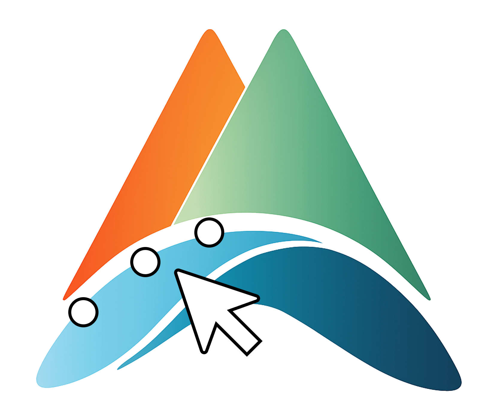
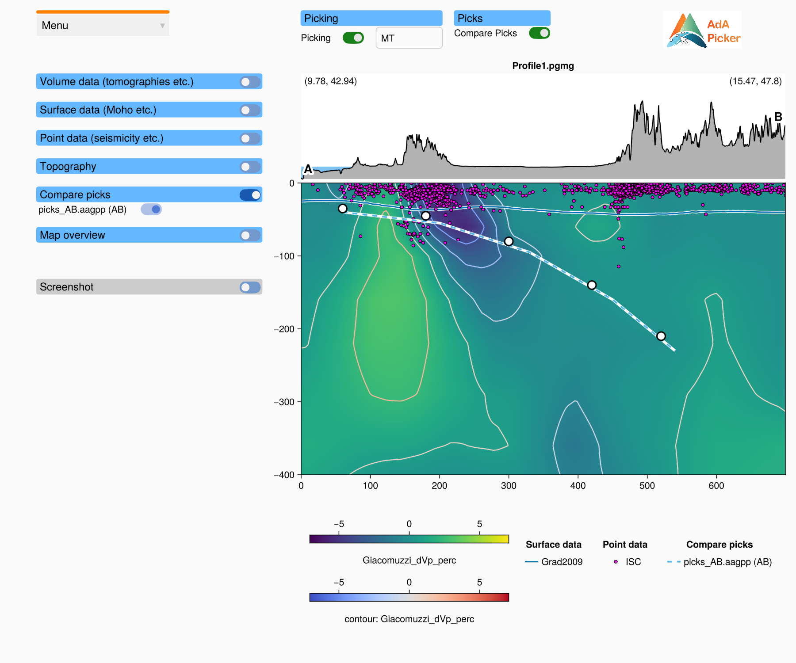
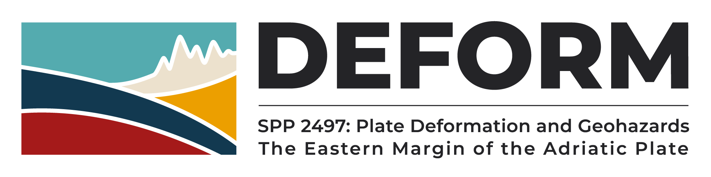

<h2>  AdriaArrayGeometryPicker.jl </h2>

<p align="center"></p>

[](https://juliageodynamics.github.io/AdriaArrayGeometryPicker.jl/stable)
[](https://juliageodynamics.github.io/AdriaArrayGeometryPicker.jl/dev/)
[](https://github.com/JuliaGeodynamics/AdriaArrayGeometryPicker.jl/actions)

The AdriaArray Geometry Picker is a graphical user interface (GUI) designed to facilitate the visualization and comparison of geophysical datasets and the picking of geometries (e.g. interfaces such as the Moho or a slab top) on them. The name stems from the [*AdriaArray*](https://orfeus.readthedocs.io/en/latest/adria_array_main.html) initiative, which focuses on investigating the Adria region with seismological methods.

> [!IMPORTANT]
> The latest version of this package represents a complete rewrite of the original AdriaArrayGeometryPicker.jl. The new version is not compatible with the old one, and the old version is no longer maintained. The new version has been designed to provide similar functionality. Please check the [manual](docs/src/manual/index.md) for the current status of the package.

The AdA Geometry Picker employs [GLMakie](https://docs.makie.org/stable/explanations/backends/glmakie.html) for graphics rendering. It builds on [GeophysicalModelGenerator.jl](https://github.com/JuliaGeodynamics/GeophysicalModelGenerator.jl) (GMG) for data handling. To use the AdA Geometry Picker, it is therefore necessary to be familiar with GeophysicalModelGenerator.jl.



### Contents
  - [Main features](#main-features)
  - [System requirements](#system-requirements)
  - [Dependencies](#dependencies)
  - [Installation](#installation)
  - [Usage](#usage)
  - [Controls](#controls)
  - [File formats](#file-formats)
  - [Documentation](#documentation)
  - [Tests](#tests)
  - [Troubleshooting](#troubleshooting)
  - [Contributing](#contributing)
  - [Origin](#origin)
  - [Funding](#funding)

### Main features
Some of the key features of the AdA Picker are:
  - compare different geophysical datasets that have been projected on GMG profiles (vertical
    cross-sections and horizontal slices): volume data (e.g. seismic tomographies) as a heatmap
    with contour lines, surface data (e.g. Moho topographies) as lines, point data (e.g.
    seismicity) as markers, the topography above the profile and a map overview,
  - manually pick locations in these profiles, and save and load these picks (JLD2 or CSV),
  - compare your picks with the picks of other files (e.g. of other users),
  - save the whole state of the window (profile, settings and picks) and restore it later.

More features are still in development.

### System requirements
This package heavily relies on GLMakie, therefore it requires an OpenGL enabled graphics card with OpenGL version 3.3 or higher as well as Julia 1.10 or newer.

### Dependencies
AdriaArrayGeometryPicker relies on several other packages, which are all installed automatically. The most notable ones are:
- [Makie.jl](https://github.com/MakieOrg/Makie.jl), in particular [GLMakie](https://docs.makie.org/stable/explanations/backends/glmakie.html)
- [GeophysicalModelGenerator.jl](https://github.com/JuliaGeodynamics/GeophysicalModelGenerator.jl)

If you are opting to use the AdriaArrayGeometryPicker, we strongly recommend to have a look at GeophysicalModelGenerator first.

### Installation
As a first step, you need to install *julia*. See the installation instructions [here](https://julialang.org/install/). Next, start julia and switch to the julia package manager using `]`, after which you can add the package.

As for now, the package is not yet registered in the Julia General Registry. This means that to add the package, one has to type the following:
```julia-repl
julia> ]
(@v1.12) pkg> add https://github.com/JuliaGeodynamics/AdriaArrayGeometryPicker.jl
```

This will install the package and all its dependencies (which may take a while). To work on the package itself, use a local clone instead: `pkg> dev path/to/AdriaArrayGeometryPicker`.

### Usage
When the installation is done, the package can be used with:
```julia-repl
julia> using AdriaArrayGeometryPicker
```
To start the GUI, enter one of
```julia
geometry_picker()                       # 1) empty window, load a profile from the menu
geometry_picker("profile.pgmg")         # 2) window with a GMG profile (.pgmg)
geometry_picker("my_state.aagps")       # 3) window with a saved state (profile, settings, picks)
```

A file is recognised by its content, not by its extension: a GUI state file is a JLD2 file with an entry `"format"` (`"AdriaArrayGeometryPicker state"`, or `"MakiePickerGUI state"` for older state files); every other file is loaded as a profile. A path that does not exist throws an `ArgumentError`. A demo profile is included:
`joinpath(pkgdir(AdriaArrayGeometryPicker), "assets", "Profile1.pgmg")`.

From the command line (from the package folder; the call blocks until the window is closed):

```
julia --project -e "using AdriaArrayGeometryPicker; geometry_picker(\"profile.pgmg\")"
```

Keywords:

- `wait = !isinteractive()`: block until the window is closed. In the REPL the call returns right away (with the session, see below); from a script or `julia -e` it waits, so that the process does not end while the window is open.
- `save = "picker.png"`: render the window offscreen into a PNG file instead of showing it (after loading the file, if one is given) and return without waiting.

`geometry_picker` returns the session, a `NamedTuple` with the figure, the `profile` Observable, the panels, axes, widgets, the picking state and the plot states. From the REPL it can be used with the exported functions, e.g.

```julia
session = geometry_picker("profile.pgmg")
p = current_picks(session)              # the picks as `Picks` (x, depth, lon, lat + metadata)
save_picks("picks.csv", p)              # or .aagpp (JLD2)
set_picks!(session, load_picks("picks.aagpp"))
save_gui_state("my_state", session)     # writes my_state.aagps
load_gui_state!(session, "my_state.aagps")
```

### Controls

Menu (top left):

| Entry | Action |
|:--|:--|
| Load Profile | open a GMG profile (`.pgmg`) |
| Save State | save the path of the profile, the settings of the window and the picks (`.aagps`) |
| Load State | restore a saved state (`.aagps`) |
| Save Picks | save the picks to a `.aagpp` or `.csv` file (`.jld2` pick files are still read) |
| Load Picks | load picks (editable) if they belong to the loaded profile |
| Load Compare Picks | show the picks of another file (e.g. of another user) as a dashed line, not editable |
| Save Screenshot | save an image of the whole window |
| Close | close the window |

Picking (switch the "Picking" toggle on; enter your name in the "User name" field and press Enter):

- **A + click**: add a pick
- **D + click**: remove the pick under the mouse
- **click and drag**: move a pick

The panels on the left (only one is expanded at a time) control the volume data (field, colormap, colour limits, contour lines and levels), the surface and point data sets, the topography, the compared picks, the map overview ("Load topography" loads a JLD2 file with a GMG `GeoData`, e.g. `etopo1.jld2`) and screenshots.

### File formats

- **Picks** (`save_picks` / `load_picks`): JLD2 (entries `format = "AdriaArrayGeometryPicker.Picks"`, `version`, `names`, `picks` -- a `NamedTuple` of columns -- and `metadata`) or CSV (metadata as `# key = value` comment lines, then a header row `x,depth,lon,lat` and one row per pick). The picks of a vertical profile have the columns `x` (distance along the profile), `depth`, `lon` and `lat`; the metadata hold the user, the date, the profile file, the profile type and its start / end coordinates (on a horizontal slice: its depth). Pick files of MakiePickerGUI.jl
  and of the original AdriaArrayGeometryPicker.jl can be loaded as well.
- **GUI state** (`save_gui_state` / `load_gui_state!`): a JLD2 file with the extension `.aagps` holding `format = "AdriaArrayGeometryPicker state"`, `version`, `profile_path` (the profile is loaded again from this file, it is not stored in the state) and `settings` (selected fields, colormaps and limits, visible data sets, expanded panels, user name, the picks and the compared picks, the topography file of the map overview).

### Tests

```
julia --project -e "using Pkg; Pkg.test()"
```

The tests build the window offscreen (they need OpenGL) and write images of it to `AdriaArrayGeometryPicker_test` in the system temp directory.

### Troubleshooting
If you encounter any issues, don't hesitate to open an issue or to ask a question in the forum. The [troubleshooting page](docs/src/manual/troubleshooting.md) of the manual answers common questions (OpenGL errors, slow first start, picking keys that do nothing, ...).

### Contributing
You are very welcome to contribute to AdriaArrayGeometryPicker by reporting bugs or by implementing new functionality.

### Funding
Early versions of this GUI have been developed with support from different DFG projects (DFG grants TH2076/7-1 and KA3367/10-1), which were part of the [SPP 2017 4DMB project](http://www.spp-mountainbuilding.de) project and the DFG Emmy Noether grant TH 2076/8-1.

This current version is being developed as part of the DFG funded Priority Program [DEFORM](https://spp-deform.de) under project number TH 2076/10-1.

<p align="center">
    <a href="https://spp-deform.de">
        <picture>
            <source media="(prefers-color-scheme: dark)" srcset="./assets/DEFORM_logo2.png">
            <source media="(prefers-color-scheme: light)" srcset="./assets/DEFORM_logo.png">
            
        </picture>
    </a>
    &nbsp;&nbsp;&nbsp;&nbsp;
    <a href="https://www.dfg.de">
        <picture>
            <source media="(prefers-color-scheme: dark)" srcset="./assets/dfg_logo_schriftzug_weiss_foerderung_en.gif">
            <source media="(prefers-color-scheme: light)" srcset="./assets/dfg_logo_schriftzug_blau_foerderung_en.gif">
            
        </picture>
    </a>
</p>


