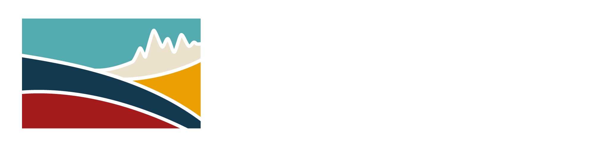
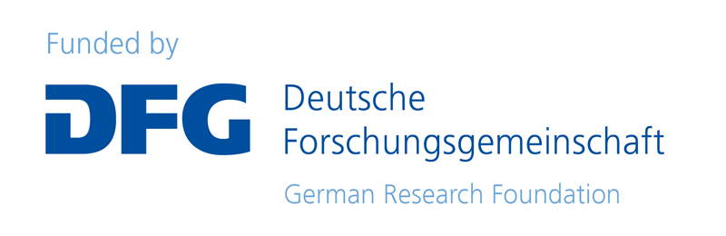

```@raw html
---
layout: home

hero:
  name: AdriaArrayGeometryPicker.jl
  text: Interpret geoscientific datasets
  tagline: A GUI to view GeophysicalModelGenerator.jl profiles and to define geometries
  image:
    src: /logo.png
    alt: AdriaArrayGeometryPicker.jl
  actions:
    - theme: brand
      text: Getting started
      link: /manual/getting_started
    - theme: alt
      text: Introduction
      link: /introduction
    - theme: alt
      text: View on GitHub
      link: https://github.com/JuliaGeodynamics/AdriaArrayGeometryPicker.jl

features:
  - title: Profiles and slices
    details: Vertical cross-sections and horizontal slices with volume data, surface data, point data, topography and a map overview.
    link: /manual/window
  - title: Picking
    details: Add, move and remove picks with the mouse, with the user name and profile stored with the picks.
    link: /manual/picking
  - title: Pick and state files
    details: Save picks as JLD2 or CSV, restore the whole state of the window and load files of earlier versions.
    link: /manual/files
  - title: Comparing picks
    details: Show the picks of other people next to your own and make them editable.
    link: /manual/compare
---
```

```@raw html
<div class="funding-logos">
  <a href="https://spp-deform.de">
    
    
  </a>
  <a href="https://www.dfg.de">
    
    
  </a>
</div>
```
