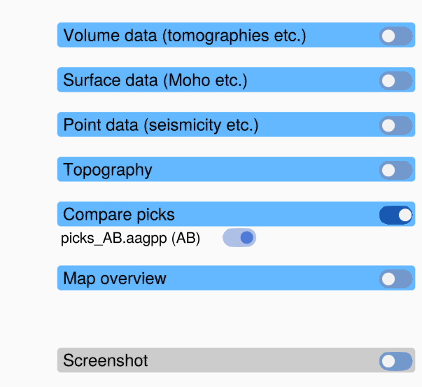

# Comparing picks

You can show the picks of other files next to your own, for example to compare the picks of
several people for the same profile, or your picks of the Moho with your picks of a slab.
Compared picks are drawn as dashed lines and cannot be edited.

## Showing picks of another file

1. Load the profile.
2. Choose **Menu → Load Compare Picks** and choose a pick file (`.aagpp`, `.csv` or `.jld2`).
3. Repeat for more files.

Each file gets:

- a dashed line in its own colour in the profile axis,
- an entry with the file name (and the user stored in the file) in the **Compare picks**
  panel, with a toggle that shows or hides this line,
- an entry in the **Compare picks** legend below the plot.

The **Compare Picks** toggle at the top of the window shows or hides all compared picks at
once. A line is visible while both its own toggle and the **Compare Picks** toggle are on.
Loading a file switches the **Compare Picks** toggle on.

A file that is already shown is not loaded a second time.

## Picks of another profile

Unlike **Load Picks**, **Load Compare Picks** also shows picks that were made on another
profile, because they may still be useful (for example on a profile that runs close by). Their
entry in the panel gets a **red background**, and a warning is logged in the REPL. Their
coordinates are drawn as they are: the distance along *their* profile is drawn as the distance
along the loaded profile.

## When compared picks are removed

Compared picks belong to the loaded profile. They are removed when you load another profile.
They are stored in a saved state (**Menu → Save State**) and restored with it.

## Making compared picks editable

Compared picks cannot be edited. To continue working on the picks of a file, load it with
**Menu → Load Picks** instead. This replaces your current picks.
