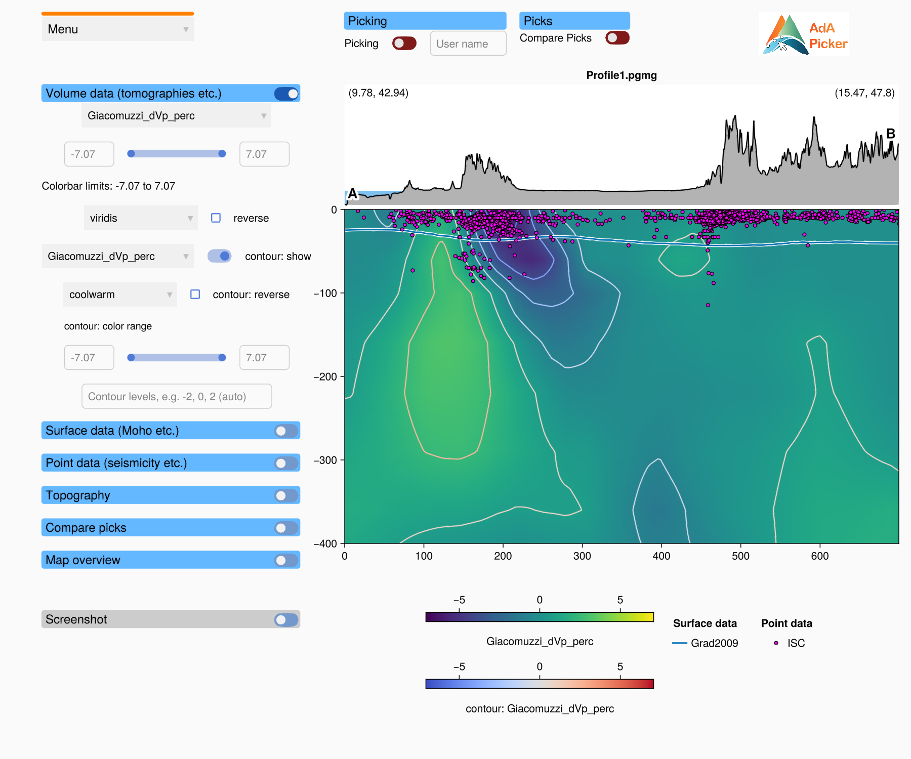

# Getting started

This page shows how to open the picker window and how to load a profile into it.

## What you need

- Julia 1.10 or newer with AdriaArrayGeometryPicker.jl installed (see [Installation](@ref)).
- A computer with OpenGL support. GLMakie opens a native window, so the picker does not run in
  a browser or on a server without a display.
- A **profile file** (`.pgmg`). A profile file is a JLD2 file with one GeophysicalModelGenerator
  `ProfileData` object, made with GeophysicalModelGenerator.jl. It is either a vertical
  cross-section or a horizontal slice at a fixed depth. The package comes with a demo profile:

  ```julia
  joinpath(pkgdir(AdriaArrayGeometryPicker), "assets", "Profile1.pgmg")
  ```

## Opening the window

[`geometry_picker`](@ref) opens the window. You can call it in three ways:

```julia
using AdriaArrayGeometryPicker

geometry_picker()                       # 1) empty window; load a profile from the menu
geometry_picker("profile.pgmg")         # 2) window with a profile
geometry_picker("my_state.aagps")       # 3) window with a saved state (profile, settings, picks)
```

The picker recognises a file by its content, not by its extension. A saved state of the
window is restored. Every other file is loaded as a profile. If the file does not exist, the
call throws an `ArgumentError`.

The first start takes a while (up to a minute or two), because Julia compiles GLMakie. Later
starts in the same Julia session are fast.

### From the REPL

In the REPL, `geometry_picker` opens the window and returns right away. The REPL stays usable,
and the return value (the *session*) gives you access to the picks and settings of the window:

```julia
session = geometry_picker("profile.pgmg")
```

### From the command line or a script

From a script, or with `julia -e`, the call waits until you close the window. Otherwise Julia
would exit and close the window right away. Run this from the package folder:

```
julia --project -e "using AdriaArrayGeometryPicker; geometry_picker(\"profile.pgmg\")"
```

You can change this behaviour with the keyword `wait`: `geometry_picker(path; wait = true)`
blocks in the REPL as well, and `wait = false` returns right away in a script.

## Loading a profile from the menu

If the window is empty, or if you want to switch to another profile:

1. Click **Menu** (top left) and choose **Load Profile**.
2. Choose a `.pgmg` file in the file dialog.

The window fills with the data of the profile. The REPL logs where the profile starts and
ends, for example:

```
[ Info: Loaded profile from (9.78, 42.94) to (15.47, 47.8)
```

!!! warning "Loading a profile removes the picks"
    Picks belong to one profile. When you load another profile, the current picks and the
    compared picks are removed. Save your picks first (**Menu → Save Picks**), or save the
    whole state (**Menu → Save State**).



## Next steps

- [The window](@ref) explains the parts of the window and how to zoom and pan.
- [Data panels](panels.md) explains the controls on the left.
- [Picking](@ref) explains how to make picks.
- [Files: picks, states, screenshots](@ref) explains how to save your work.
