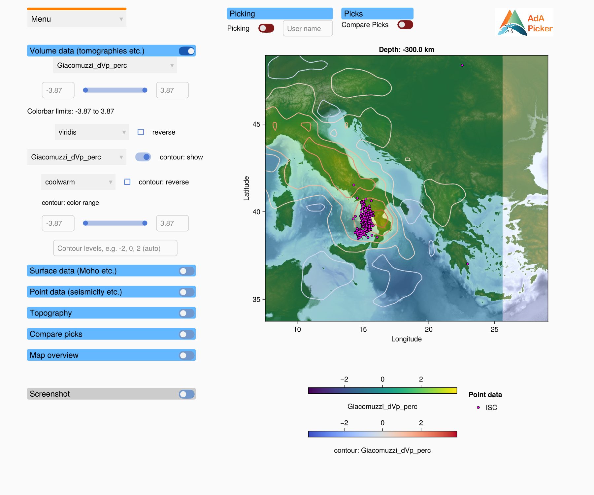
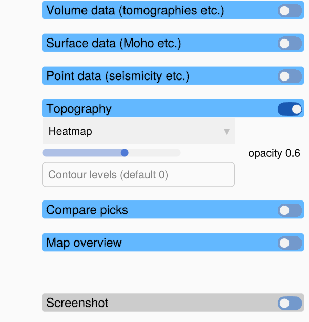

# Horizontal slices

A profile file can also hold a horizontal slice: a map of the data at a fixed depth. The
picker recognises the type of profile when it loads the file and adapts the window.

## What changes

| | Vertical profile | Horizontal slice |
|:--|:--|:--|
| profile axis | distance along the profile (km) × depth (km) | longitude × latitude, with the depth of the slice as title |
| aspect ratio | free | a degree of longitude is drawn `cos(latitude)` times as long as a degree of latitude, so the map is not distorted |
| topography axis | above the profile | hidden |
| topography | line in the topography axis | heatmap or contour lines on top of the volume data |
| volume data fields | fields of the volume data | in addition, the depth of each surface data set (`<name>: depth`) |
| surface data | lines along the profile | contour line where the surface crosses the depth of the slice |
| point data | projected onto the profile | at their longitude and latitude |
| map overview | line from **A** to **B** | box around the slice, labelled with its depth |
| picks | `x` and `depth` | longitude and latitude |

## Topography on a horizontal slice

The topography panel of a horizontal slice has:

| Control | What it does |
|:--|:--|
| data set dropdown | Only if the profile has several topography data sets: which one to show. |
| mode dropdown | **Heatmap**: the topography as a semi-transparent heatmap (colormap `oleron`, centred on sea level). **Contours**: contour lines of the topography. **Off**: no topography. |
| **opacity** slider | The opacity of the topography heatmap. Lower it to see more of the volume data below. |
| **Contour levels** | The elevations of the contour lines, for example `0` for the coastline (the default) or `-2, 0, 2`. Press Enter. |

## Picking on a horizontal slice

Picking works as on a vertical profile (see [Picking](@ref)), but the picks are positions on
the map. In a saved pick file:

- `lon` and `lat` hold the picked position,
- `depth` holds the depth of the slice for every pick,
- `x` is `NaN` (there is no distance along a profile),
- the metadata hold the `depth` of the slice instead of start and end coordinates.

**Load Picks** only accepts picks that were made on a horizontal slice at the same depth.
