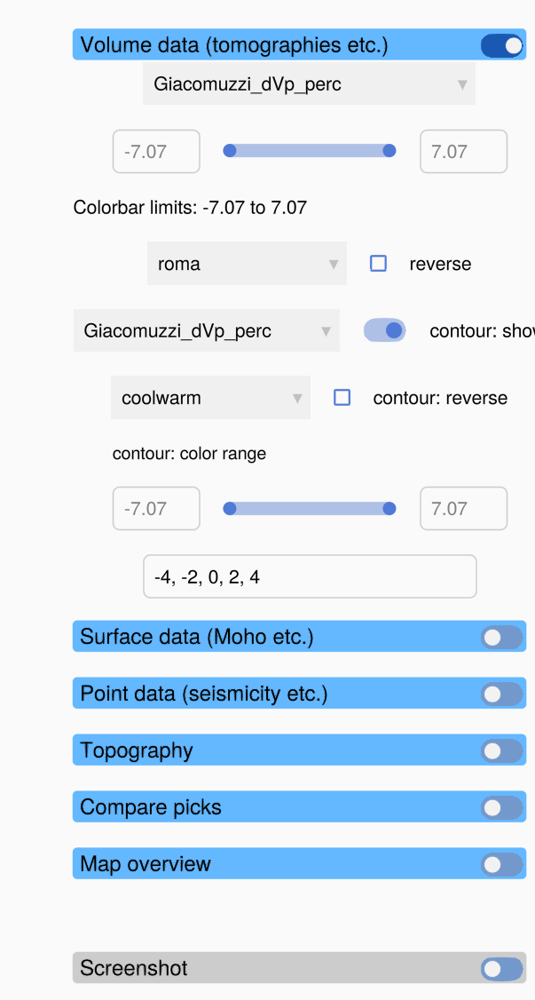
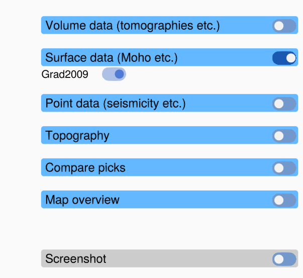
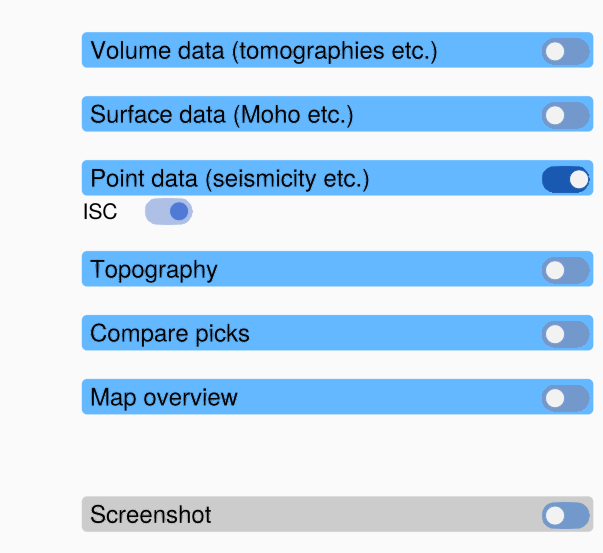
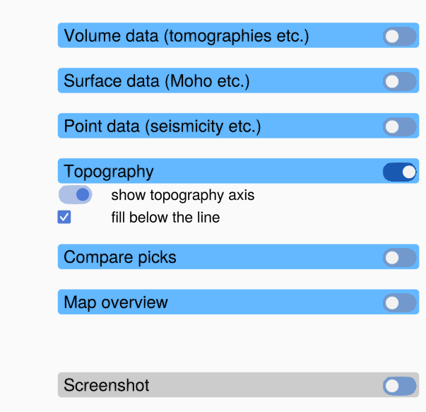
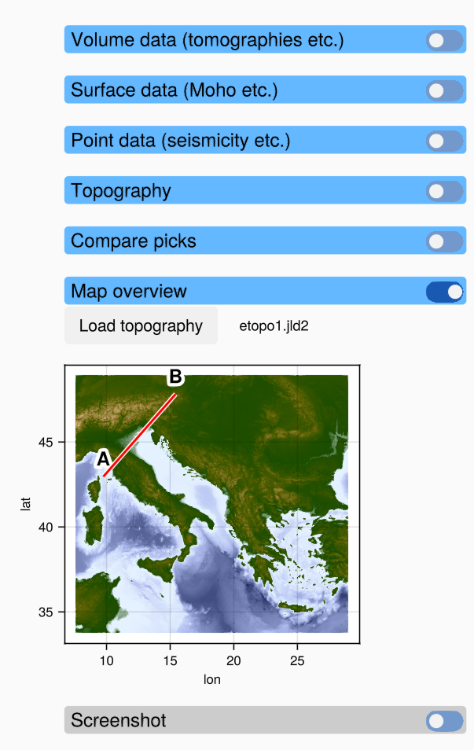

# Data panels

The panels on the left control what the plot area shows. Switch the toggle in the header of a
panel on to expand it. Only one panel is expanded at a time.

Most panels are filled when a profile is loaded, and their content depends on the data in the
profile. The panels for surface data, point data and topography stay empty (or say so) if
the profile has no such data.

!!! tip "Text fields need Enter"
    The text fields in the panels (colorbar limits, contour levels, user name) only take a
    value when you press **Enter**.

## Volume data (tomographies etc.)

The volume data panel controls the heatmap and the contour lines in the profile axis. It is
expanded when the window opens.

From top to bottom:

| Control | What it does |
|:--|:--|
| **field** dropdown | The data field shown as a heatmap, for example `Giacomuzzi_dVp_perc`. It lists all fields of the volume data of the profile. If several data sets have a field of the same name, the name of the data set is put in front. |
| **min** / slider / **max** | The colour limits of the heatmap. Drag the ends of the slider, or type a value into **min** or **max** and press Enter. The slider covers ± the largest absolute value of the field, so the limits start symmetric around zero. |
| *Colorbar limits* | Shows the current limits. |
| **colormap** dropdown, **reverse** | The colormap of the heatmap and whether it is reversed. All matplotlib colormaps and the [Scientific colour maps](https://www.fabiocrameri.ch/colourmaps/) of Fabio Crameri (`roma`, `vik`, `batlow`, ...) are offered. |
| **contour field** dropdown, **contour: show** | The data field shown as contour lines (it can differ from the heatmap field), and a toggle that shows or hides them. |
| **contour colormap**, **contour: reverse** | The colormap of the contour lines. |
| **contour: color range** | The colour limits of the contour lines (slider and text fields, as above). |
| **Contour levels** | The values at which contour lines are drawn, separated by commas, semicolons or spaces, for example `-4, -2, 0, 2, 4`. Leave it empty to get 10 evenly spaced levels inside the contour colour range. |

The colorbars below the plot show the colormaps and limits of the heatmap (top) and of the
contour lines (bottom). The contour colorbar is hidden while the contour lines are hidden.

When you choose another field, the colour limits are reset to fit the new field.

## Surface data (Moho etc.)

Surface data (for example a Moho model) are drawn as coloured lines with a white outline,
so that they stay visible on any heatmap colour. The panel has one toggle per surface. Switch
it off to hide the surface. The **Surface data** legend below the plot names the surfaces;
the entry of a hidden surface is greyed out.

Surfaces that do not cross the profile are left out.

## Point data (seismicity etc.)

Point data (for example earthquake hypocentres) are drawn as small markers in bright colours.
The panel has one toggle per data set, and the **Point data** legend below the plot names the
data sets.

## Topography

For a vertical profile, the topography along the profile is drawn in the axis above the
profile axis. The panel has:

| Control | What it does |
|:--|:--|
| data set dropdown | Only if the profile has several topography data sets: which one to show. |
| **show topography axis** | Show or hide the topography axis. When it is hidden, the profile axis takes its space. |
| **fill below the line** | Fill the area below the topography line (grey above sea level, blue below). |

For a horizontal slice the topography is drawn on top of the volume data instead; see
[Horizontal slices](@ref).

If the profile has no topography data, the panel says *No topography data* and the
topography axis is hidden.

## Compare picks

This panel lists the pick files shown for comparison, each with a toggle. It is empty until
you load picks with **Menu → Load Compare Picks**. See [Comparing picks](@ref).

## Map overview

*The map overview with `etopo1.jld2` loaded.*

The map shows where the profile lies. A vertical profile is drawn as a red line from its start
**A** to its end **B**. A horizontal slice is drawn as a box around its area, labelled with its
depth.

The map has no background at first. Click **Load topography** and choose a JLD2 file that
holds a GeophysicalModelGenerator `GeoData` with elevation data (for example `etopo1.jld2`) to
show a topography map below the profile line. The name of the loaded file is shown next to the
button. Very large grids are thinned to about 1000 × 1000 points, so the map stays responsive.

The topography file of the map is remembered in a saved state (**Menu → Save State**) and
loaded again when the state is restored, as long as the file still exists.

## Screenshot

This panel has no controls. To save an image of the window, use **Menu → Save Screenshot**
(see [Screenshots](@ref)).
