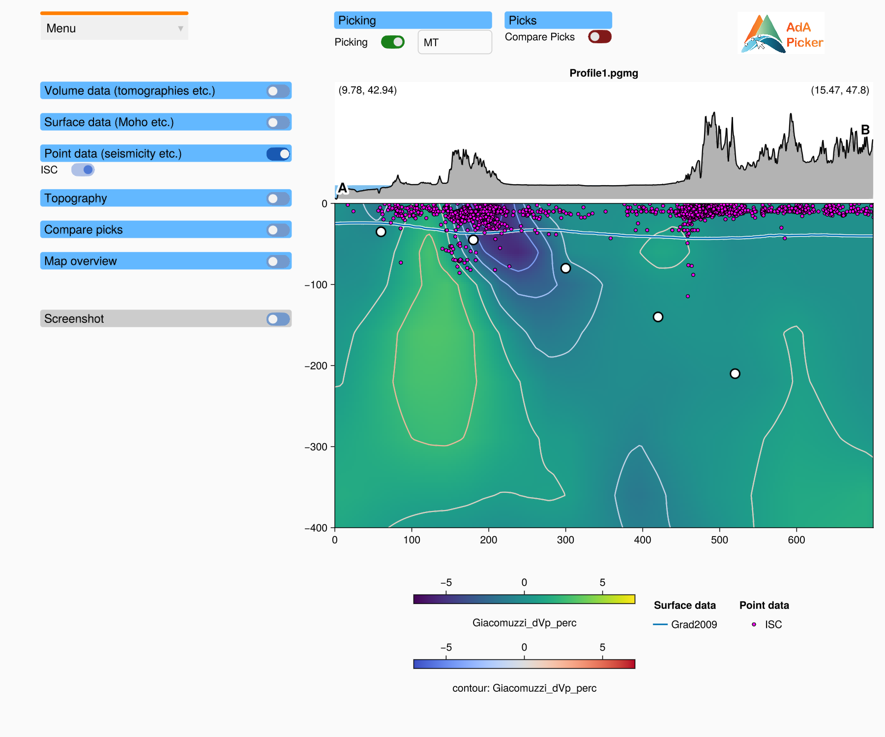

# Picking

A *pick* is a point that you place on the profile, for example on the Moho or the top of a
slab. Your picks are drawn as white circles with a black outline. They are kept in the order
in which you add them.

## Step by step

1. **Load a profile** (**Menu → Load Profile**), or open the window with a profile file.
2. **Enter your name.** Click the **User name** field at the top, type your name or initials
   and press **Enter**. The name is stored with the picks when you save them, so that picks of
   different people can be told apart.
3. **Switch picking on.** Click the **Picking** toggle. It turns green.
4. **Add picks.** Hold the **A** key and click into the profile axis. A pick is added at the
   mouse position.
5. **Correct picks.**
   - To **move** a pick, click on it and drag it to the new position. Release the mouse
     button to drop it.
   - To **remove** a pick, hold the **D** key and click on it.
6. **Save the picks** with **Menu → Save Picks** (see [Saving picks](@ref)).
7. Switch picking off when you are done, so that you do not move picks by accident while you
   zoom and pan.

## Mouse and keys

Picking only works while the **Picking** toggle is on, and only inside the profile axis.

| Mouse / keys | Action |
|:--|:--|
| **A** + left click | add a pick at the mouse position |
| **D** + left click on a pick | remove this pick |
| left click on a pick and drag | move the pick |

Holding **Ctrl** in addition to **A** or **D** is allowed.

Clicks that do not hit a pick, and all clicks while picking is off, go to the axis as usual
(rectangle zoom, pan, reset; see [Zooming and panning](@ref)). So you can zoom in to pick
precisely and zoom out again without switching picking off.

!!! tip "Pick in order"
    The picks are saved in the order in which you added them, not sorted by distance. If you
    want a line from one end of the profile to the other, add the picks from one end to the
    other. A pick that you move keeps its place in the order.

!!! note "The window must have the keyboard focus"
    The **A** and **D** keys only reach the picker while its window is the active window.
    Click once into the window (for example on an empty spot) if the keys seem to do nothing.
    Also make sure the cursor is not in a text field: while a text field is active, the keys
    type into it.

## What is stored with the picks

On a vertical profile each pick has:

- `x`: the distance along the profile (km),
- `depth`: the depth (km, negative downward),
- `lon`, `lat`: the longitude and latitude, interpolated along the profile.

In addition, the pick file stores your user name, the date, the name of the profile file, the
type of the profile (vertical or horizontal) and the coordinates of its start and end point.
These are used to check that picks belong to the loaded profile when you load them again.

On a horizontal slice, picks are made in the longitude / latitude plane; see
[Horizontal slices](@ref).

## Picks and profiles

Picks belong to one profile:

- When you load another profile, the picks are removed. Save them first.
- **Load Picks** only accepts picks that were made on the loaded profile (same start and end
  point, or the same depth for a horizontal slice). Otherwise it logs a warning in the REPL
  and leaves the current picks alone.
- To see picks of another profile anyway, use **Load Compare Picks** (see
  [Comparing picks](@ref)).
